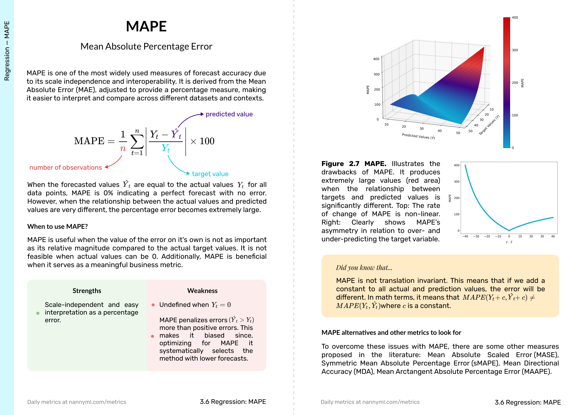

# The Little Book of ML Metrics

Welcome to the open source repo of The Little Book of ML Metrics. The idea of the book is to be this little handbook that sits on every data scientist's desk for quick reference, from the most well-known metric, ahem, accuracy, to the most obscure ones (looking at you, P4 metric).

## Why are we writing this book?

Machine learning metrics are often overlooked in traditional data science courses and university degrees. This book aims to fill that gap by offering clear, concise, and actionable explanations of the metrics that matter most. Whether you're an aspiring data scientist or an experienced professional, this book will become your go-to reference for understanding and leveraging metrics effectively.

> **Disclaimer:** The book is open-source, which means you can freely access the digital version. However, we also offer a [high-quality printed edition](https://www.nannyml.com/metrics) for purchase. Revenue from printed copies helps support further development and maintenance of the book. Reviewers, contributors, and authors receive revenue sharing through their affiliate links.

## Book Contents

The book covers a broad range of metrics from different contexts:

- **Regression**
- **Classification**
- **Clustering**
- **Ranking**
- **Computer Vision**
- **NLP**
- **GenAI** 
- **Probabilistic**
- **Bias and Fairness**
- **Business**

## How to Contribute

We welcome contributions from the community! As a thank-you for your contributions, each contributor will receive an affiliate link with **[X]%** commission on sales generated through their link. Please check our [Contributing Guidelines](CONTRIBUTING.md) for more details.

## Interested in Being a Book Reviewer?

If you're an expert in any of the topics described in the book contents section and would like to review this book, please fill out [this form](https://docs.google.com/forms/d/e/1FAIpQLSejLhxhGowCimOG_1-RLvevB8czKZsW8PM7PwPoi0_8tfGqHw/viewform). As a thank-you, reviewers will receive an affiliate link with **[Y]%** commission on sales generated through their link.

## About the Authors

**[Santiago Viquez](https://www.linkedin.com/in/santiagoviquez/)**  
ML Developer Advocate at NannyML. Santiago has over five years of professional experience in ML and data science. He holds a Bachelor’s degree in Physics and a Master’s degree in Data Science.

**[Wojtek Kuberski](https://www.linkedin.com/in/wojtek-kuberski/)**  
Co-founder and CTO at NannyML. Wojtek is an AI professional and entrepreneur with a Master’s degree in AI from KU Leuven. He co-founded NannyML, an OSS Python library for ML monitoring and post-deployment data science. As the CTO, he leads the research and product teams, contributing to the development of novel algorithms in model monitoring.

## Project Support

This project is backed by [NannyML](https://www.nannyml.com/), the only platform for monitoring machine learning models in production that can estimate model performance metrics without ground truth.
